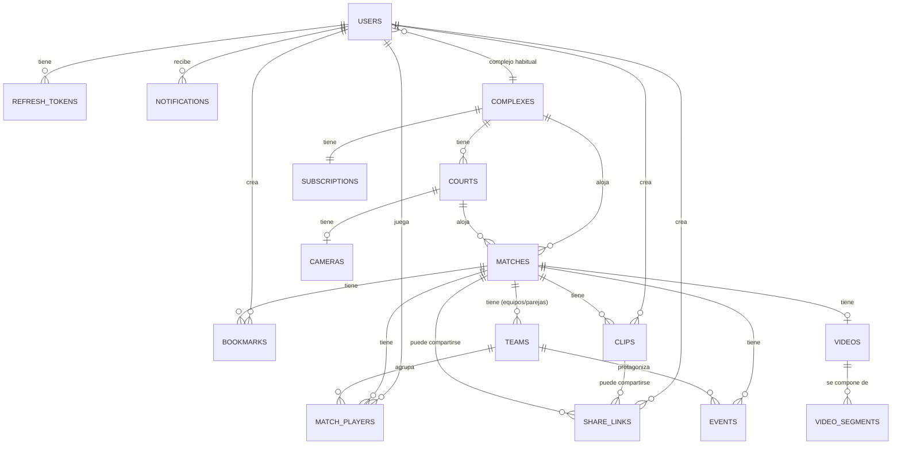

# LIVEPLAY — Modelo de base de datos

PostgreSQL, modelado con Drizzle ORM (`backend/src/db/schema.ts`). Las migraciones SQL
versionadas viven en `backend/src/db/migrations/`.

## Diagrama entidad-relación

## Entidades y decisiones de diseño

### `users`
Un solo modelo para los 3 roles (`SUPER_ADMIN`, `COMPLEX_ADMIN`, `PLAYER`) — se optó por un
enum `role` en vez de tablas separadas porque comparten el 100% de los campos de perfil y la
autorización se resuelve mejor con un guard sobre el rol que con joins distintos por tipo de
usuario. `managed_complex_id` (para `COMPLEX_ADMIN`) y `home_complex_id` (para `PLAYER`, "mi
complejo habitual") son ambos nullable y semánticamente distintos.

### `refresh_tokens`
Separado de `users` (no un solo campo) para soportar múltiples sesiones activas (celular +
notebook) y poder revocar una sesión sin cerrar las demás. Se guarda el **hash** del token, no
el token en sí — un dump de la base no alcanza para robar sesiones.

### `complexes` / `courts` / `cameras`
`courts.sport_type` vive en la cancha, no en el partido — una cancha de Fútbol 5 no pasa a ser
de Pádel de un día para el otro, así que tiene sentido que sea un atributo estable de la
cancha. `cameras` tiene una relación 1:1 con `courts` (`court_id UNIQUE`) porque hoy el
requerimiento es una cámara por cancha; si más adelante una cancha necesita ángulos múltiples,
alcanza con quitar el `UNIQUE`.

### `matches`
El corazón del modelo. `date` es un campo `date` puro (sin hora) además de `start_time`
(timestamp completo) porque el buscador filtra por fecha con muchísima más frecuencia que por
hora exacta — tener ambos evita tener que truncar `start_time` en cada query (y permite
indexar `date` directamente). `result_summary` es `jsonb` deliberadamente: fútbol guarda
`{equipoAzul: 7, equipoRojo: 5}`, pádel guarda `{sets: ["6-4","4-6","10-8"]}` — son formas de
resultado genuinamente distintas y forzarlas a columnas rígidas hubiera significado o bien
duplicar la tabla por deporte, o una tabla `results` con un modelo genérico de "puntaje" que
en la práctica también termina siendo semi-estructurado. El resultado estructurado real
(goles/sets por equipo) igual vive normalizado en `teams.score`/`teams.sets_won`.

### `teams`
Fútbol → "Equipo Azul"/"Equipo Rojo"; Pádel → "Pareja A"/"Pareja B". Mismo modelo para ambos
deportes (una fila por bando del partido) — evita tener `FutbolTeam` y `PadelPareja` como
tablas separadas cuando conceptualmente cumplen el mismo rol (agrupar jugadores + llevar el
puntaje de ese bando).

### `match_players`
Tabla puente entre `matches`, `teams` y `users`, con `guest_name` opcional — un partido casi
siempre tiene invitados sin cuenta (§15 ejemplo: "Invitado 1"). `user_id` nullable a propósito.

### `videos` / `video_segments`
Separados 1:N deliberadamente (§11 — "no depender de un archivo único"). `videos` guarda
metadata global (duración, resolución, claves del manifest/sprite); `video_segments` guarda
cada segmento HLS con su offset acumulado (`start_offset_seconds`/`end_offset_seconds`) — esto
es lo que le permite al timeline saber "el segundo 1834 está en el segmento 6" sin tener que
parsear el `.m3u8` en cada request.

### `events`
Genérico para ambos deportes (`type` incluye `GOAL`, `YELLOW_CARD`, `RED_CARD`, `GREAT_SAVE`,
`HIGHLIGHT`, `SET_POINT`, `CUSTOM`) en vez de una tabla por tipo de evento — la timeline y el
reproductor tratan todo evento igual (icono + timestamp + salto), así que una tabla polimórfica
simple es más simple de mantener que 5 tablas con la misma forma.

### `bookmarks` vs. `events`
Dos tablas separadas aunque se parecen: `events` es contenido **editorial** del partido (lo
carga un admin, es igual para todos los que ven el partido); `bookmarks` es **privado por
jugador** (§7 — "Timeslice" personal). Mezclarlos hubiera requerido un campo
`visibility`/`owner` sobre `events` y complicado los permisos de lectura.

### `clips`
Independientes del video original (§16: "sin modificar el video original") — tienen su propia
`storage_key` (un `.mp4` generado aparte). `status` (`PENDING`/`READY`/`FAILED`) porque la
generación es asíncrona (encolada en BullMQ).

### `share_links`
Genérico para compartir un `match_id` **o** un `clip_id` (nunca ambos — se valida en el
service). `expires_at` nullable (permanente si no se especifica) + `revoked_at` para revocación
manual + `view_count` para saber cuánto se usó un link.

### `notifications` / `audit_logs`
`notifications` es lo que ve el usuario ("tu partido ya está disponible"); `audit_logs` es
para el administrador/seguridad (login, eliminaciones, cambios). Confundirlos hubiera mezclado
una tabla de alto volumen de escritura silenciosa (auditoría) con una que el usuario lee y
pagina activamente.

### `subscriptions`
Una fila por complejo (`complex_id UNIQUE`), preparada para monetización futura (§37/§20):
`plan`, `status`, `camera_limit`, `retention_days` — este último es exactamente el campo que
usaría la política de "eliminar partidos después de 30/60/90 días" (§35), configurable por
complejo/plan sin tocar código.

## Índices (pensados para los patrones de acceso reales, no genéricos)

- `matches(complex_id, date)`, `matches(court_id, date)`, `matches(sport_type, date)` — los
  tres filtros más comunes del buscador (§5).
- `events(match_id, timestamp_seconds)` — el reproductor siempre pide "los eventos de este
  partido, ordenados por tiempo".
- `video_segments(video_id, index)` único — garantiza que no haya dos segmentos con el mismo
  índice para el mismo video, y es el índice que usa el reproductor/worker para reconstruir el
  video completo en orden.
- `bookmarks(match_id, user_id)` — "mis marcadores de este partido".
- `refresh_tokens(user_id)`, `notifications(user_id, read)`, `clips(match_id)`,
  `clips(created_by_user_id)`, `audit_logs(user_id)`, `audit_logs(action)`.
